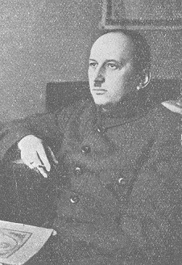
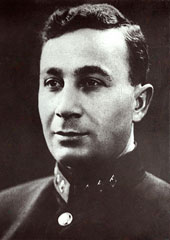

# Alexandre A. Svetchine

CYCLE GUERRE RUSSO-JAPONAISE
- Actions tactiques en montagne basées sur l’expérience de la guerre russo-japonaise (1906)
- Préjugés et Réalités du Combat (1907)
- La Guerre russo-japonaise de 1904-1905 (1910)
- Leçons tactiques de la guerre russo-japonaise (1912)

[Evolution de l'Art Militaire](evoartmil.md)

Stratégie - 1926
  - [Première Partie ("Préfaces", "Introduction" et "Stratégie et politique")](Stratégie 1.pdf)
  - [Deuxième Partie ("Préparation du Front armé", "Combinaison des opérations" et "Commandement")](Stratégie 2.pdf)

Clausewitz

# Georgi S. Isserson 

[isserson-georgii-samoilovich.jpg](isserson-georgii-samoilovich.jpg) 

- [L'Evolution de l'Art Opératif](L'Evolution de l'Art Opératif.pdf) - 1932, 2nde édition en 1936

- [Les Fondements de l'Opération en Profondeur](Les Fondements de l'Opération en Profondeur.pdf) - 1933

- [Les Fondements de l'Opération Défensive](Les Fondements de l'Opération Défensive.pdf) - 1938

- [Les Fondements de la Conduite des Opérations](Les Fondements de la Conduite des Opérations.pdf) - 1939

- [Les Nouvelles Formes de Lutte](Les Nouvelles Formes de Lutte.pdf) - 1940

- [Le Développement de la Théorie de l'Art Opératif](Le Développement de la Théorie de l'Art Opératif.pdf) - 1965

# Vladimir K. Triandafillov

- [La Nature des Opérations des Armées Modernes](La Nature des Opérations des Armées Modernes.pdf) - 1929

- [Interaction entre les fronts de l’Ouest et du Sud-Ouest lors de l’offensive estivale de l’Armée rouge sur la Vistule en 1920](Interaction entre le Front Ouest et le Front Sud-Ouest.pdf) - 1925 (Guerre et révolution n°2, mars-avril)

# Divers

- [Concentration opérationnelle](Concentration opérationnelle Zhuravlev.pdf) - N. Zhuravlev (1935)

# Collectif 

[L'Art Opératif - Développements dans les théories de la guerre (Extraits choisis)](L'art opératif - Développements dans les théories de la guerre.pdf) - 1996

- Introduction, par M.A. Hennessy et B.J.C. McKercher

- L'Art opératif : Développements dans les théories de la guerre, par John English

- Deux vues de Varsovie : La Guerre Civile russe et l'art opératif soviétique, 1920-1932, par Jacob Kipp

- La Dimension intellectuelle de l'art opératif soviétique (russe), par David Glantz

