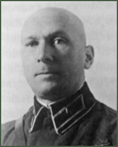

## Georgi S. Isserson 

 

[L'Evolution de l'Art Opératif](L'Evolution de l'Art Opératif.pdf) - 1932, 2nde édition en 1936

[Les Fondements de l'Opération en Profondeur](Les Fondements de l'Opération en Profondeur.pdf) - 1933

[Les Fondements de l'Opération Défensive](Les Fondements de l'Opération Défensive.pdf) - 1938

## Collectif 

[L'Art Opératif - Développements dans les théories de la guerre (Extraits choisis)](L'art opératif - Développements dans les théories de la guerre.pdf) - 1996

- Introduction, par M.A. Hennessy et B.J.C. McKercher

- L'Art opératif : Développements dans les théories de la guerre, par John English

- Deux vues de Varsovie : La Guerre Civile russe et l'art opératif soviétique, 1920-1932, par Jacob Kipp

- La Dimension intellectuelle de l'art opératif soviétique (russe), par David Glantz

