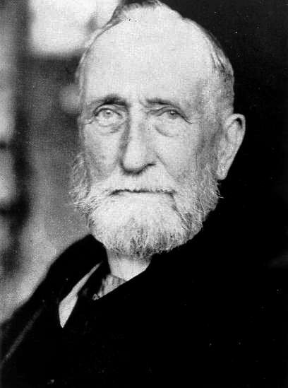

# Alexandre A. Svetchine

## L'Évolution de l'Art militaire (1928)

- T.1 Chapitre 1 : [Phalange grecque. Alexandre le Grand](T1C1 Phalange grecque.pdf)
- T.2 Chapitre 3 : [La Guerre Civile aux États-Unis](T2C3 Guerre Civile USA.pdf) 

# Hans Delbrück

## Histoire de l'Art de la Guerre

- I. L'Antiquité
- III. Le Moyen-Âge
- IV. L'Époque Moderne
  - *La Période des Armées Nationales (Vol. IV, Livre 4)*

# Invasion 1914 : Du Plan Schlieffen à la Bataille de la Marne

- [Introduction et Chapitre 1](Invasion1914 Chap1.pdf) : Le Plan Schlieffen-Moltke
- [Chapitre 2](Invasion 1914 Chap2.pdf) : Plan XVII

